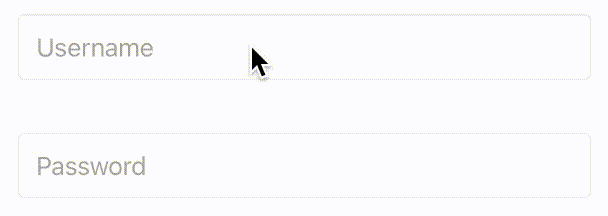
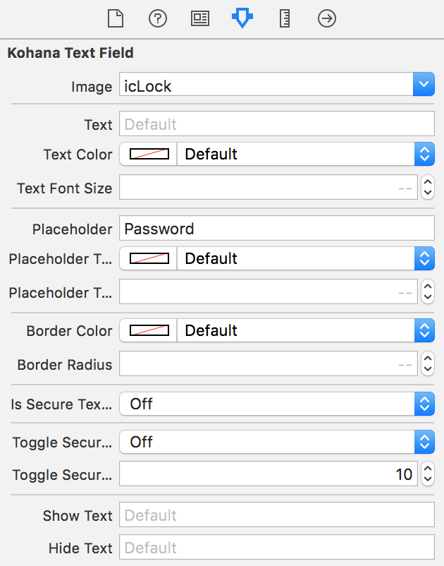

# KohanaTextField
[](https://badge.fury.io/gh/natangr%2Fkohanatextfield) 

This is an iOS library that implements the Kohana Text Field animation.



## How to use
### Storyboard
Create an UIView on your storyboard and set the view's class as KohanaTextField.
On the attribute inspector you will have access to several configurable fields.



## Installation
To install this element, add the following line to your podfile:
```
pod 'KohanaTextField'
```

## Credits
[Natan Grando (natangr)](https://github.com/natangr) - Mobile Developer ([LinkedIn](https://www.linkedin.com/in/natan-grando-36820397))

**Thank you for your contributions:**

[Thais Nolasco (thaisns)](https://github.com/thaisns)
* Design specs
